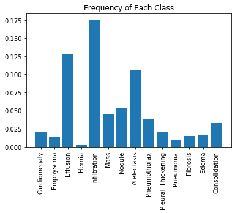
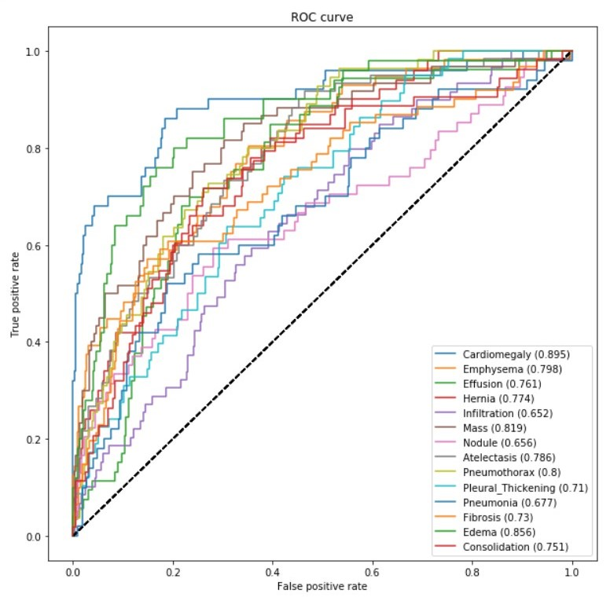

[![Contributors][contributors-shield]][contributors-url]
[![Forks][forks-shield]][forks-url]
[![Stargazers][stars-shield]][stars-url]
[![Issues][issues-shield]](https://github.com/aadimangla/Chest-X-ray-Classification/issues)
[![MIT License][license-shield]][license-url]
[![LinkedIn][linkedin-shield]][linkedin-url]

<!-- PROJECT LOGO -->
 

   

  <h1 align="center">Chest X-ray Classification</h1>

  

    <!-- An awesome README template to jumpstart your projects! -->
     
<!--     <a href=""><strong>Explore the docs »</strong></a> -->
     
     
    <!--<a href="">View Demo</a>
    ·
    <a href="">Report Bug</a>
    · -->
    <a href="https://github.com/aadimangla/Chest-X-ray-Classification/issues">Request Feature</a>
  

---
<!-- TABLE OF CONTENTS -->
## Table of Contents

* [About the Project](#about-the-project)
  * [Built With](#built-with)
* [Getting Started](#getting-started)
  * [Prerequisites](#prerequisites)
* [Usage](#usage)
* [Roadmap](#roadmap)
* [Contributing](#contributing)
* [License](#license)
* [Contact](#contact)
* [Acknowledgements](#acknowledgements)

---

<!-- ABOUT THE PROJECT -->
## About The Project

Chest X-ray Classification is based on computer vision algorithms. It analyses the x-rays uploaded by the user and classifies them into appropriate disease. Diseases which it can predict are Edema, Hernia, Mass, Pneumonia, Infiltration, Fibrosis and many more.

Here's why:
* Artificial intelligence can assist doctors in finding the right treatments among many options for cancer, Capturing data from various databases relating to the condition, AI helps physicians identify & choose the right drugs for the right patients, AI supports the decision-making processes for existing drugs & expanded treatments for other conditions, as well as expediting the clinical trials process by finding the right patients from a number of data sources.

We will be using the [ChestX-ray8 dataset](https://arxiv.org/abs/1705.02315) which contains 108,948 frontal-view X-ray images of 32,717 unique patients. 
- Each image in the data set contains multiple text-mined labels identifying 14 different pathological conditions. 
- These in turn can be used by physicians to diagnose 8 different diseases. 
- We will use this data to develop a single model that will provide binary classification predictions for each of the 14 labeled pathologies. 
- In other words it will predict 'positive' or 'negative' for each of the pathologies.
 
You can download the entire dataset for free [here](https://nihcc.app.box.com/v/ChestXray-NIHCC). 
- We have provided a ~1000 image subset of the images for you.
- These can be accessed in the folder path stored in the `IMAGE_DIR` variable.

The dataset includes a CSV file that provides the labels for each X-ray. 

### Built With
This was build using following frameworks, libraries and softwares.
* [Tensorflow](https://www.tensorflow.org/)
* [Keras](https://keras.io/)
* [Matplotlib](https://matplotlib.org/)
* [Seaborn](https://seaborn.pydata.org/)
* [Pandas](https://pandas.pydata.org/)
* [Numpy](https://numpy.org/)
* [OpenCV](https://opencv.org/)

---
## Class Imbalance Problem
One of the challenges with working with medical diagnostic datasets is the large class imbalance present in such datasets. Let's plot the frequency of each of the labels in our dataset:

We can see from this plot that the prevalance of positive cases varies significantly across the different pathologies. (These trends mirror the ones in the full dataset as well.) 
* The `Hernia` pathology has the greatest imbalance with the proportion of positive training cases being about 0.2%. 
* But even the `Infiltration` pathology, which has the least amount of imbalance, has only 17.5% of the training cases labelled positive.

Ideally, we would train our model using an evenly balanced dataset so that the positive and negative training cases would contribute equally to the loss. 

If we use a normal cross-entropy loss function with a highly unbalanced dataset, as we are seeing here, then the algorithm will be incentivized to prioritize the majority class (i.e negative in our case), since it contributes more to the loss. 

Let's visualize these two contribution ratios next to each other for each of the pathologies:

As we see in the above plot, the contributions of positive cases is significantly lower than that of the negative ones. However, we want the contributions to be equal. One way of doing this is by multiplying each example from each class by a class-specific weight factor, $w_{pos}$ and $w_{neg}$, so that the overall contribution of each class is the same. 

To have this, we want 

$$w_{pos} \times freq_{p} = w_{neg} \times freq_{n},$$

which we can do simply by taking 

$$w_{pos} = freq_{neg}$$
$$w_{neg} = freq_{pos}$$

This way, we will be balancing the contribution of positive and negative labels.
Let's verify this by graphing the two contributions next to each other again:

---
## ROC Curve

---

<!-- USAGE EXAMPLES -->
## How AI used in Medicine?

There is already an incredible amount of technology and automation in play in medicine, whether we realise it or not - medical records are digitised, appointments can be scheduled online, patients can check in to health centres or clinics using their phones or computers. As technology usage has increased in all areas of life, so too has it quietly changed the ways in which we seek medical care.

For example, Futurism lists the following examples of AI already being used in medicine today:

Decision support systems - When given a set of symptoms, DXplain comes up with a list of possible diagnoses

Laboratory information systems - Germwatcher is designed to detect, track and investigate infections in hospitalised patients

Robotic surgical systems - The da Vinci robotic surgical system, with robotic arms, precise movement and magnetised vision, allows doctors to precision surgery that wouldn’t be possible with an entirely manual approach

Therapy - AI Therapy is an online course for people struggling with social anxiety

Reducing human error - Babylon is an online application where patients in the UK can book appointments and routine tests, plus consult with a doctor online, check for symptoms, get advice, monitor their health and order test kits

The potential for increased AI usage in medicine is not just in a reduction of manual tasks and the freeing up of physician’s time, increasing efficiency and productivity - it also presents the opportunity for us to move towards more ‘precision medicine’.

---

<!-- ROADMAP -->
## Roadmap

See the [open issues](https://github.com/aadimangla/Chest-X-ray-Classification/issues) for a list of proposed features (and known issues).

---
<!-- CONTRIBUTING -->
## Contributing

Contributions are what make the open source community such an amazing place to be learn, inspire, and create. Any contributions you make are **greatly appreciated**.

1. Fork the Project
2. Create your Feature Branch (`git checkout -b feature/AmazingFeature`)
3. Commit your Changes (`git commit -m 'Add some AmazingFeature'`)
4. Push to the Branch (`git push origin feature/AmazingFeature`)
5. Open a Pull Request

---

<!-- LICENSE -->

## License

- **[MIT license](http://opensource.org/licenses/mit-license.php)**
- Copyright 2020 © <a href="http://adityamangla.com" target="_blank">Aditya Mangla</a>.

---

<!-- CONTACT -->
## Contact

Aditya Mangla - [@aadimangla](https://twitter.com/aadimangla) - aadimangla@gmail.com - [adityamangla.com](http://www.adityamangla.com/index.html)

Project Link: [https://github.com/aadimangla/Chest-X-ray-Classification](https://github.com/aadimangla/Chest-X-ray-Classification)

---

<!-- MARKDOWN LINKS & IMAGES -->
<!-- https://www.markdownguide.org/basic-syntax/#reference-style-links -->
[contributors-shield]: https://img.shields.io/github/contributors/aadimangla/Chest-X-ray-Classification.svg?style=flat-square
[contributors-url]: https://github.com/aadimangla/Chest-X-ray-Classification/graphs/contributors
[forks-shield]: https://img.shields.io/github/forks/aadimangla/Chest-X-ray-Classification.svg?style=flat-square
[forks-url]: https://github.com/aadimangla/Chest-X-ray-Classification/network/members
[stars-shield]: https://img.shields.io/github/stars/aadimangla/Chest-X-ray-Classification.svg?style=flat-square
[stars-url]: https://github.com/aadimangla/Chest-X-ray-Classification/stargazers
[issues-shield]: https://img.shields.io/github/issues/aadimangla/Chest-X-ray-Classification.svg?style=flat-square
[issues-url]: https://github.com/aadimangla/Chest-X-ray-Classification/issues
[license-shield]: https://img.shields.io/github/license/aadimangla/Chest-X-ray-Classification.svg?style=flat-square
[license-url]: https://github.com/aadimangla/Chest-X-ray-Classification/blob/master/LICENSE.txt
[linkedin-shield]: https://img.shields.io/badge/-LinkedIn-black.svg?style=flat-square&logo=linkedin&colorB=555
[linkedin-url]: https://linkedin.com/in/aadimangla
[product-screenshot]: images/screenshot.png
